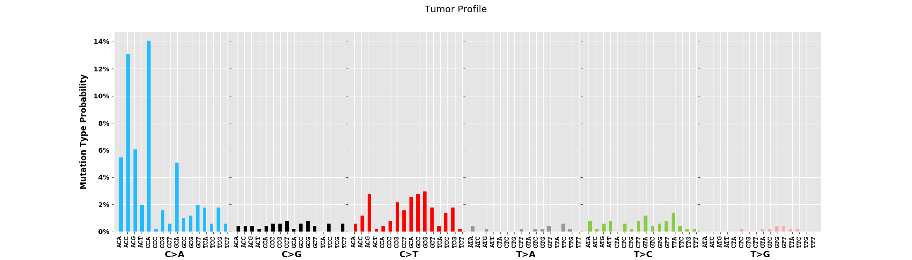
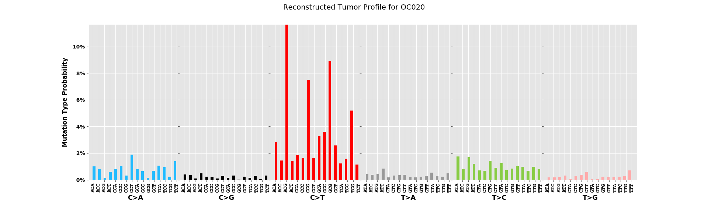
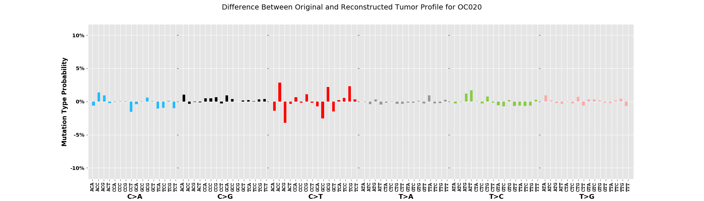
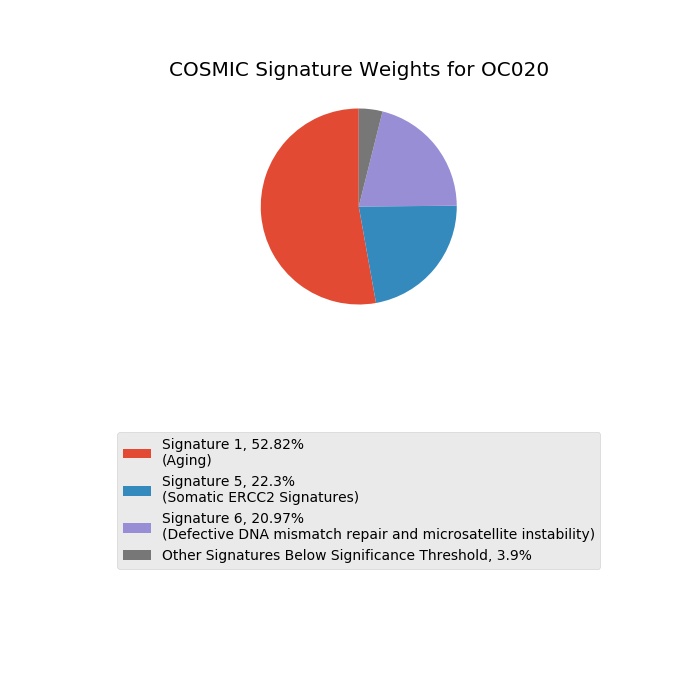
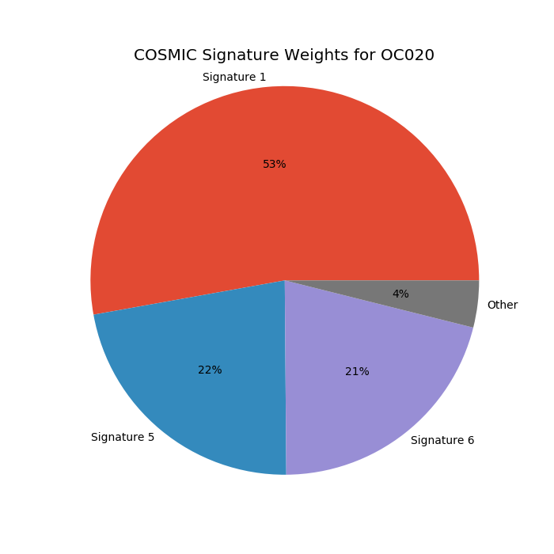

# DeconstructSigs
Given a MAF or folder of MAF files, find the optimal linear combination of COSMIC mutational signatures that best
describe the sample's SNV trinucleotide context distribution.

A Python implementation of the DeconstructSigs algorithm described in
https://genomebiology.biomedcentral.com/articles/10.1186/s13059-016-0893-4. Modeled after the R implementation
coded by Rachel Rosenthal which can be found at https://github.com/raerose01/deconstructSigs.

From the GenomeBiology description:

*The deconstructSigs approach determines the linear combination of pre-defined signatures that most accurately
reconstructs the mutational profile of a single tumor sample. It uses a multiple linear regression model with
the caveat that any coefficient must be greater than 0, as negative contributions make no biological sense.*

Installation
------------
To install the deconstructSigs package, use the Python package installer pip:
  
  `pip install deconstructSigs`
  
Then simply import the class DeconstructSigs from the deconstructSigs package, as illustrated below in the "Usage" section.

To edit the code on your machine, click the green Clone or Download button above, copy the presented web URL, and then paste it into your terminal, preceded by the command 'git clone'.

  `git clone https://github.com/vanallenlab/deconstruct_sigs_py.git`

Parameters
----------
The following parameters can be provided to an DeconstructSigs object upon initialization:

* `maf_file_path`: Optional path to a single MAF file. If provided, analysis will be conducted on this file. Either this parameter or mafs_folder must be supplied.

* `mafs_folder`: Optional path to a folder containing multiple MAF file. If provided, analysis will be conducted on all MAF files within the given folder. Either this parameter or maf_file_path must be supplied.

* `context_counts`: Optional. This argument can be used to provide a dictionary of context counts rather than a MAF file. Keys are of the form 'A[C>A]A', 'A[C>A]C', etc., and values are integer counts.

* `cutoff`: Optional, default value of 0.06. The weights of all signatures calculated to be contributing less than the cutoff will be zeroed. These signatures will be considered 'Other' in the pie chart generated by a call to figures()

* `outfile_path`: Optional. If provided, calculated signature weights will be output here upon calling which_signatures().

* `analysis_handle`: Optional. If provided, analysis_handle will be used in the titles of all plots and figures generated.

* `hg19_fasta_path`: Optional. If provided, analysis will determine trinucleotide context by using samtools to search within provided fasta file for each SNP. Requires local installation of samtools, as samtools is run through subprocess. If not provided, DeconstructSigs assumes that the MAF file contains a ref_context column.


The **which_signatures()** method outputs the vector of weights calculated for each signature. It takes a few parameters as well:

* `signatures_limit`: Optional, default None. If provided, number of signatures allowed to contribute to solution is capped at signatures_limit. Otherwise up to 30 COSMIC signatures could potentially be used.

* `associated`: Optional, default None, list of integer indices of COSMIC signatures in range 0-29. Useful when it is known that only a pre-determined subset of COSMIC signatures should be tried.

* `verbose`: Optional, default False. If True then logs describing weight updates on each iteration will be output to stdout.


Finally, to generate figures, use the **figures()** method, with the following parameters:

* `weights`: Required. The vector of weights generated by the which_signatures() method.

* `explanations`: Optional, default is False. If explanations is set to True, the signatures pie chart will include curated information about each COSMIC signature selected directly on the pie chart in the legend.

Usage
-----
```
from deconstructSigs import DeconstructSigs


def main():
    fasta_path = '/path/to/Homo_sapiens_assembly19.fasta'
    ds = DeconstructSigs(maf_file_path='/path/to/snvs.maf',
                         hg19_fasta_path=fasta_path)

    weights = ds.which_signatures(verbose=True)
    ds.plot_signatures(weights, explanations=True)

if __name__ == '__main__':
    main()
```

Output
------
Output of **figures()**:
* Tumor profile

* Reconstructed tumor profile

* Difference between original and reconstructed tumor profile

* COSMIC signatures breakdown with explanations

* COSMIC signatures breakdown


Data Sources
------------
* Cosmic Signature Probabilities (signatures_probabilities.txt): http://cancer.sanger.ac.uk/cosmic/signatures
* Signature Etiologies (about_cosmic_sigs.txt): http://cancer.sanger.ac.uk/cosmic/signatures, with updates added by Van Allen Lab
